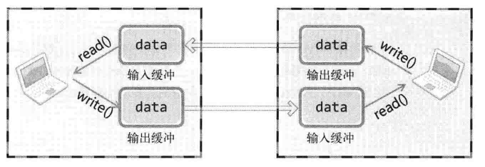

## 回声客户端的完美实现

回声服务器相关代码

```c++
while((str_len = read(client_sock, message, BUF_SIZE)) != 0) {
    write(client_sock, message, str_len);
}
```

回声客户端相关代码

```c++
while(true) {
    fputs("Input message(Q to quit): ", stdout);
    fgets(message, BUF_SIZE, stdin);
    ...
    write(sock, message, strlen(message));
    str_len = read(sock, message, BUF_SIZE - 1);
    message[str_len] = 0;
    printf("Message from server: %s\n", message);
}
```

问题所在：

```c++
    write(sock, message, strlen(message));
    str_len = read(sock, message, BUF_SIZE - 1);
```

解决方法见 echo_client2.c 。

这里我们直到要接受的字节长度，但是通常我们是不知道要接收的数据长度的，这个时候我们可以通过定义应用层协议（即：定义好的规则）来判断接收数据何时结束。

## TCP 的工作原理

数据的收发无边界

write函数调用的瞬间，数据将移到输出缓冲；
read函数调用的瞬间，从输入缓冲读取数据。



如图，调用write函数时，数据将移到输出缓冲，在适当的时候（不管是分别发送还是一次性发送）传到对方的输入缓冲。这时，对方将调用read函数从输入缓冲读取数据。

- I/O缓冲在每个TCP套接字中单独存在
- I/O缓冲在创建套接字时自动生成
- 即使关闭套接字，也会继续传递输出缓冲中遗留的数据（write后，可以关闭套接字，不影响已经write的数据）
- 关闭套接字会丢失输入缓冲中的数据（但，关闭套接字后，不能read这个套接字的输入数据了）
